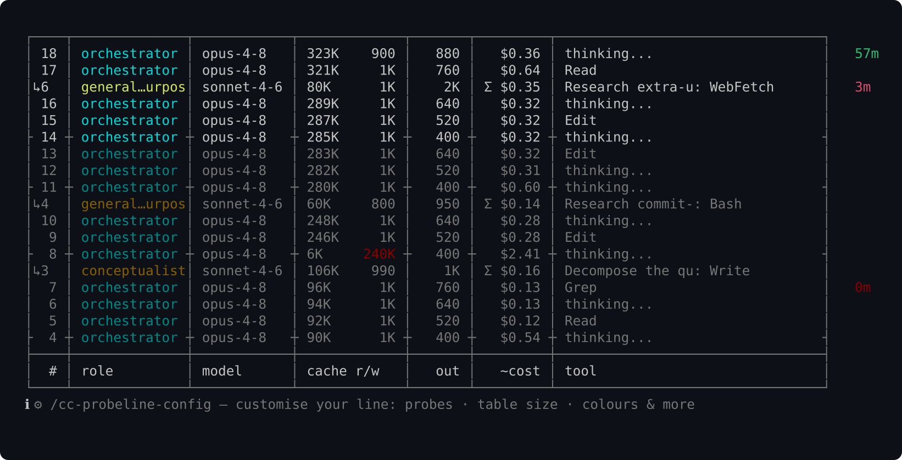
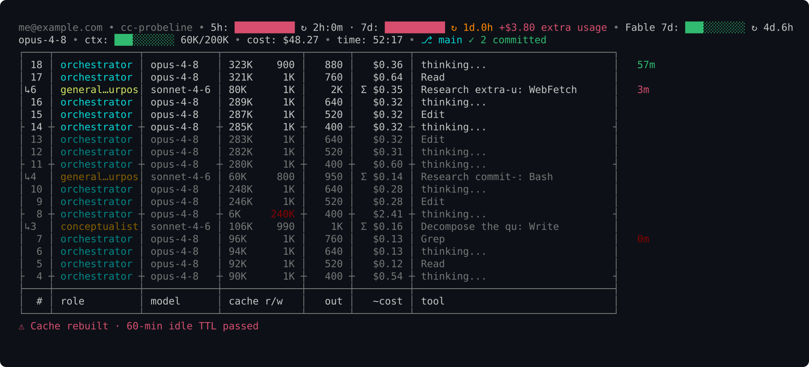
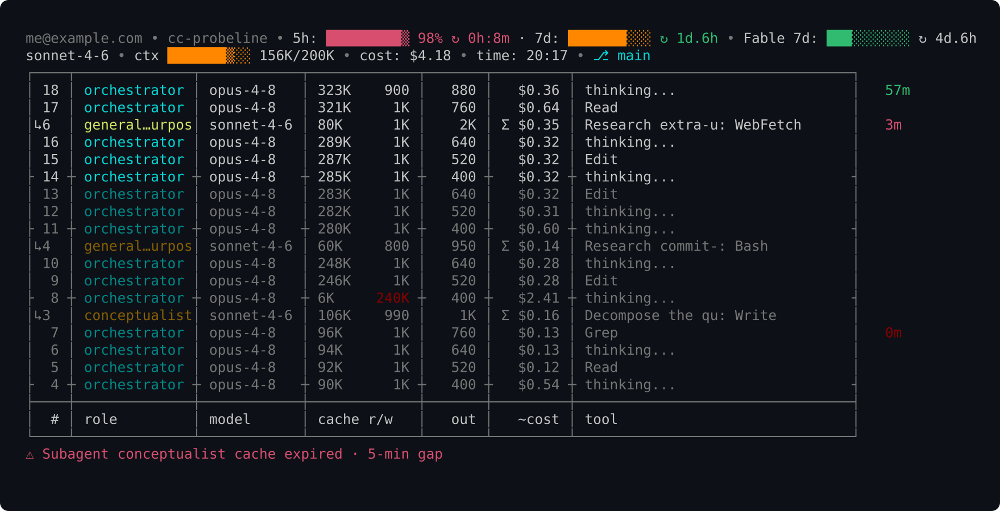
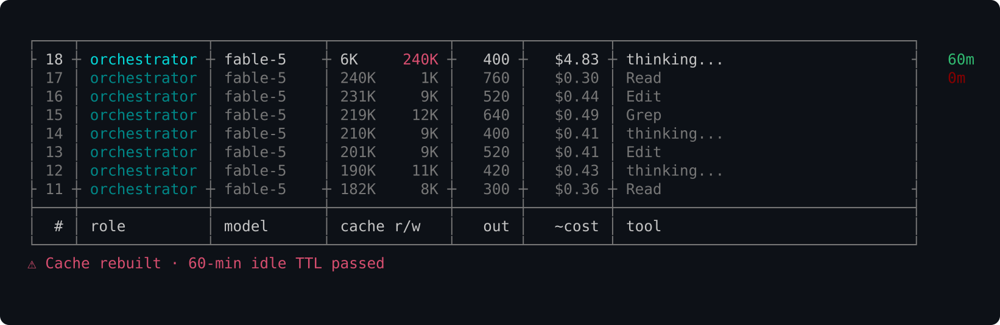

[](https://github.com/labzink/cc-probeline/releases)
[](https://github.com/labzink/cc-probeline/actions/workflows/test.yml)
[](LICENSE)


# See where it leaks. Stop paying for it.

A live dashboard right in your status line — surfacing what Claude Code hides: the cost of every turn, what your subagents spend, how long your cache stays alive, plus current 5h/7d and Fable 7d limits, context and git.

And it takes exactly as much room as you let it: every row is configurable, down to a single line.

**Stop overpaying for inefficiency you can't see. Spend your limits on purpose.**

**Install in one command:**

```sh
curl -fsSL https://raw.githubusercontent.com/labzink/cc-probeline/main/scripts/install.sh | sh
```
**[See all install options →](#install)**


## What the probe pulls out

Most status lines count things — tokens, turns, running agents. **The probe prices them.** Everything below comes out of your session's local log: data Claude Code has, but never shows you.

- **Every turn, priced** — not one opaque session total: a live table where each step lands with its own cost.
- **What your subagents spend** — subagent work is invisible while it runs. The probe puts each agent on the bill, live, next to your own turns.
- **Cache rebuilds, in dollars** — idle past the TTL (60 min for the orchestrator, 5 for subagents), and your next turn quietly rewrites the whole cache. The probe ages it live (⏱ 60m → 0m) and prices the rebuild when it hits.
- **Extra usage in money, not percent** — past 100% of your plan, the overage shows up in dollars before the invoice does.
- **Prices that stay correct** — your dollars are only as honest as the price table behind them. cc-probeline refreshes its rates over the network — one optional, opt-out check a day, never during render — so when Anthropic changes prices your totals follow within a day, no reinstall. Offline or opted out, it falls back to the table baked into the build.
- **5h / 7d limits with reset clocks** — watch them fill, know exactly when they free up.
- **Per-model limits, not just the total** — Claude Code shows a separate weekly window for models that have one, but never puts it in the status-line payload: you only see it by opening `/usage`. cc-probeline reads it from the snapshot Claude Code caches locally and puts it on the line next to the account-wide bars — `Fable 7d: ▒░░░░░░░░░ ↻ 6d.8h` — every bar labelled, so the scoped figure is never mistaken for the total.
- **Fits the room you give it** — the full dashboard is eight rows; the legend, the borders, the per-turn table and either header line each switch off from the config, and they stack. Take it down to one line of quota bars, or leave it exactly as it ships. Every key defaults to the full layout.
- **Colour-coded zones** — numbers shift colour as they enter warning and critical territory, so the line catches your eye exactly when it should.
- Plus the table stakes: model, context, git, session time.


**Every turn lands on its own line — orchestrator and subagents alike — priced as it happens. Finally you see where every dollar of your reasoning actually goes.**

**Built to fit your terminal.** Don't like a segment, the colours, the width — or how many rows it eats? The `/cc-probeline-config` wizard walks you through it and writes the config for you — no hand-editing TOML. (That's the hint at the bottom of the dashboard above.)


**The moment you cross 100%, you'll see it — and the extra bill stays under your control.**


**You get warned while there's still time to act — not after you've hit the wall.**


**Cache rebuilds stop being silent — you see the price the moment they happen.**

And nothing about your session ever leaves your machine — that's [why it's called a probe](#why-its-called-a-probe).

## Why it's called a probe

A probe is an instrument of observation, not intervention. Everything cc-probeline does is read and display — it never reaches into your account or reports on you.

- **What it reads:** your session's JSONL log (`~/.claude/projects/…`) and the status-line payload Claude Code pipes directly to it.
- **What it doesn't touch:** credentials, keychain, OAuth tokens — no telemetry, ever. Rendering is fully offline; the only network it ever makes is one optional, opt-out price/version check a day — a plain download of a public file, sending nothing about your session. Turn it off and it never touches the network at all.
- **The binary:** single compiled Go binary, no runtime dependencies, one run ≈ 5 ms.
- **Auditable:** MIT license, open source, every release published with SHA256 checksums and signed build provenance (SLSA) — verify any download with `gh attestation verify <file> --repo labzink/cc-probeline`.

## Install

Every channel below does the same thing: install the binary **and** wire it into
your Claude Code status line. After installing, **restart Claude Code** and you're
done — no extra commands. (If you already have a custom status line, it's left
untouched; switch to cc-probeline with `cc-probeline install --merge-settings --force`.)

**Homebrew** (macOS — it's a cask; on Linux use curl below):

```sh
brew install labzink/homebrew-tap/cc-probeline
```

**curl** (macOS / Linux — downloads the release archive for your OS, verifies SHA256, installs the binary):

```sh
curl -fsSL https://raw.githubusercontent.com/labzink/cc-probeline/main/scripts/install.sh | sh
```

**Scoop** (Windows, experimental):

```powershell
scoop bucket add labzink https://github.com/labzink/scoop-bucket
scoop install cc-probeline
```

**Claude Code plugin marketplace:**

```
/plugin marketplace add labzink/cc-probeline
```

Then install the plugin from the `/plugin` menu (or `/plugin install cc-probeline`) and **restart Claude Code** — the slash commands below only show up after a restart.

Once restarted, run `/cc-probeline-install`: it detects your OS, installs the binary through the right channel (Homebrew / Scoop / curl) and wires the status line — asking before it runs anything. You can still install manually with any channel above. The plugin also gives you `/cc-probeline-update` to upgrade later and the `/cc-probeline-config` wizard.

**Verify your installation:**

```sh
cc-probeline --check
```

Prints `Installation OK`.

### Requirements

- Claude Code on macOS, Linux, or Windows.
- For the quota segment (5h / 7d limits, extra usage): Claude Code ≥ 2.1.80, which passes `rate_limits` in the status-line payload. On older versions the quota segment is hidden; everything else works normally.
- For the per-model segment (`Fable 7d: …`): a plan that actually has a model-scoped weekly limit. These windows never reach the status-line payload, so the figures are read from the usage snapshot Claude Code caches in `~/.claude.json` — locally, read-only, no credentials and no network. No scoped limit on the account means the segment simply does not render.

### Configuration

Run the interactive wizard from inside Claude Code:

```
/cc-probeline-config
```

It walks you through probes, table size and colours — and writes the TOML for you. Or edit `~/.config/cc-probeline/config.toml` directly (validate with `cc-probeline check-config`).

Every field is optional and every default is the full layout, so you only ever write the lines you want to change:

```toml
[general]
table_rows     = 10   # per-turn cost table: rows to keep (0 = no table, max 40)
table_legend   = true # the "# role model cache r/w …" labels      (2 rows)
table_frame    = true # ┌─┐ / └─┘ borders and the outer bars        (2 rows)
table_dividers = true # inner │ separators — costs no rows, only visual noise
header_line0   = true # email • project • quota
header_line1   = true # model • ctx • cost • time • git
header_merge   = false # join the two header rows when they fit on one
bar_width      = 10   # progress-bar segments, 3-20 (8 keeps small values visible)
bar_style      = "block" # or line / low / dot / none (percentage instead of a bar)
effort_style   = "glyph" # or "word" — spell the effort out instead of ◕
model_variant_tag = true # false drops the "[1m]" tag from the model name
tutorial_hints = true # false stops the rotating tips; alerts still show

[widgets]             # flip any single segment off
email = false
```

Config is read in precedence order: `CC_PROBELINE_CONFIG=/path` (explicit override) → `.cc-probeline.toml` in the current repo (project-local) → `~/.config/cc-probeline/config.toml` (global). An invalid value never breaks the status line — it falls back to the default.

Full reference — colour thresholds, cost budget, every widget: [`scripts/config.toml.example`](scripts/config.toml.example).

#### Three layouts to start from

The keys stack, so the dashboard scales from eight rows down to one. Pick whichever trade you want and paste it.

**As it ships — 8 rows.** Everything on: quota header, session header, and the last 10 turns priced in a bordered table with column labels. Nothing to configure.

**Sensible middle ground — 5 rows.** Keeps every number that costs you money and drops only the decoration around it:

```toml
[general]
table_rows     = 3      # the last few turns, still priced
table_legend   = false  # column labels stop paying rent once you know them
table_frame    = false  # columns stay aligned without the borders
tutorial_hints = false

[widgets]
email   = false         # you know whose account this is
project = false         # your terminal title already says it
```

```
5h: █░░░░░░░░░ ↻ 0h:43m · 7d: ▒░░░░░░░░░ ↻ 6d.8h • Fable 7d: ▒░░░░░░░░░ ↻ 6d.8h
opus-5 • cost: $4.22 • time: 08:34 • ⎇ main ⚠ 10
196 │ orchestrator │ opus-5 │ 326K     1K │   109 │   $0.18 │ Read          ⏱ 60m
195 │ orchestrator │ opus-5 │ 325K    883 │   255 │   $0.18 │ thinking...
194 ┼ orchestrator ┼ opus-5 ┼ 320K     5K ┼   825 ┼   $0.23 ┼ thinking...
```

**Limits only — 1 row.** For when the status line should answer exactly one question, *how much is left*, and get out of the way:

```toml
[general]
table_rows     = 0      # no per-turn table at all
header_line1   = false  # drop model • ctx • cost • time • git
tutorial_hints = false

[widgets]
email   = false
project = false
```

```
5h: █░░░░░░░░░ ↻ 0h:43m · 7d: ▒░░░░░░░░░ ↻ 6d.8h • Fable 7d: ▒░░░░░░░░░ ↻ 6d.8h
```

A header line whose every segment is switched off is dropped entirely rather than left blank, so the widget toggles reclaim the row too.

### Updating

When a newer release is out, the status line surfaces it: `↑ update: vX → vY — run /cc-probeline-update`. Run that command inside Claude Code and it upgrades through whichever channel you installed with (and installs it for you if the binary is missing). Or update by hand:

```sh
brew upgrade labzink/homebrew-tap/cc-probeline                                                   # Homebrew
scoop update cc-probeline                                                                        # Scoop
curl -fsSL https://raw.githubusercontent.com/labzink/cc-probeline/main/scripts/install.sh | sh   # curl (re-runs latest)
```

The update notice comes from a once-a-day price/version check; turn it off with `price_check = false` (or in the `/cc-probeline-config` wizard) and cc-probeline stays fully offline. Updating keeps your status-line wiring intact.

### Uninstall

Uninstalling restores the status line you had before (byte-for-byte, if cc-probeline replaced one) and removes the binary. Use the command for the channel you installed with — **restart Claude Code afterwards**:

```sh
brew uninstall cc-probeline                                                                            # Homebrew — also restores your previous status line
curl -fsSL https://raw.githubusercontent.com/labzink/cc-probeline/main/scripts/install.sh | sh -s -- --uninstall   # curl
```

**Scoop** (Windows): restore the status line first, then remove the binary — `scoop uninstall` can't run the restore step itself:

```powershell
cc-probeline uninstall
scoop uninstall cc-probeline
```

To only un-wire the status line without removing the binary, run `cc-probeline uninstall` on its own.

## The experiment

cc-probeline is a personal experiment: can you hand programming over to AI **entirely** — every line of code, every design decision — and still end up with a product that matches the operator's vision **exactly**?

This is the answer. Claude wrote all of it; the operator never touched the code. What the operator owned was everything that decides whether it's any good: the vision, the spec, the design direction, and every single call — reviewed detail by detail until the result was exactly right. A few weeks of spare-time work — competitor research, a written spec, phased design and implementation. The commit history is public and reads like a build log: you can watch the product take shape, phase by phase.

**Contributing:** bug reports and ideas are welcome — open an issue.

MIT License. This is a fork of [cc-probeline](https://github.com/labzink/cc-probeline) by Konstantin Labzin, extended with configurable vertical footprint and per-model quota windows.
